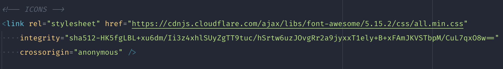
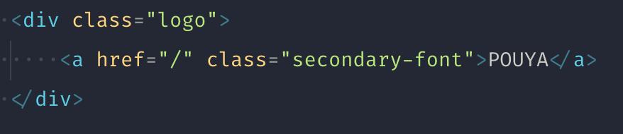
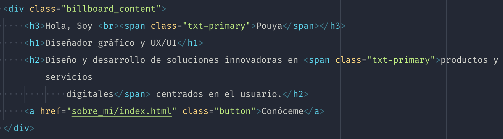
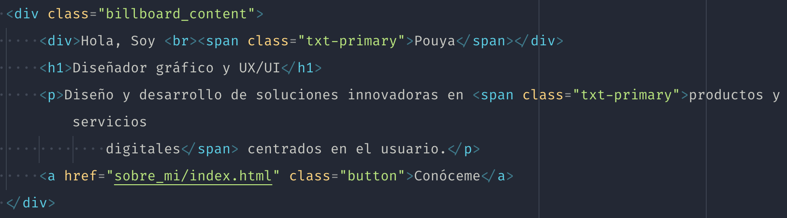
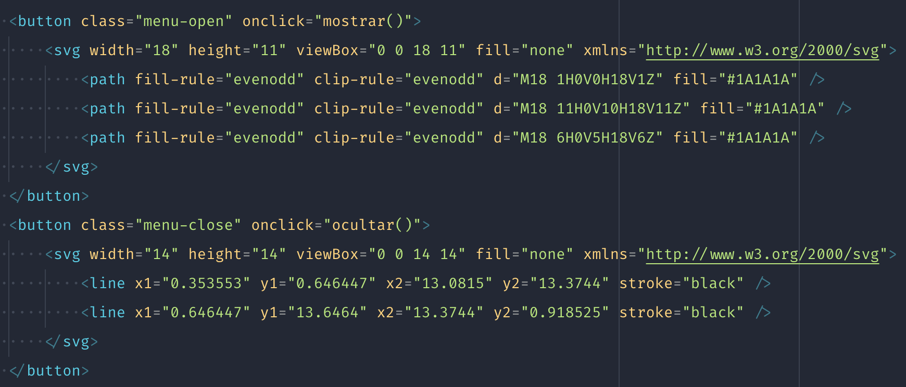
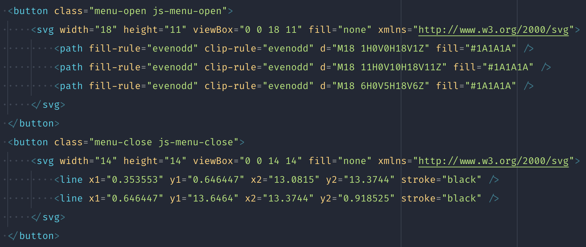
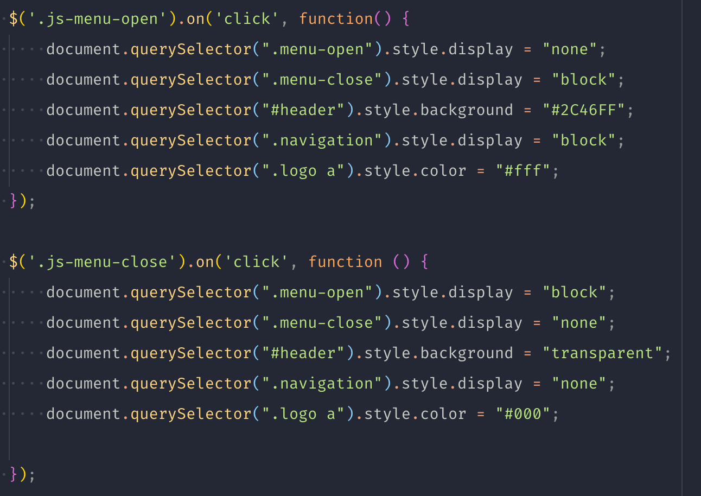

# Review final

Buen trabajo Pouya, tienes un código muy organizado y limpio. Me hubiese gustado ver terminado el proyecto, ya que ahora está sin imágenes. Te paso el feedback para que puedas seguir mejorándolo.

Veo que has utilizado font-awesome para los iconos. No está mal, pero la librería pesa bastante y al final, solo la utilizas para 5 iconos como mucho. En este caso te recomendaría utilizar svg, sin librerías, esto ayudaría a la velocidad de carga de tu página.



En el logo, puedes simplificarlo poniendo la clase `logo` al elemento link y cambiando su propiedad `display: block;`. Y de preferencia, utiliza minúsculas para mejorar la accesibilidad web, y si quieres mostrarlo en mayúsculas, utiliza la propiedad de css `text-transform: uppercase;`



En la presentación de la home, intenta no utilizar headings para estilar elementos. Además, estos elementos debería estar en un orden y seguir una lógica de narración correcta.




Para utilizarlo en una narración sería algo como:

```html
<main>
    <h1>Título principal de la página</h2>

    <section>
        <h2>Título secundario</h2>
        <p>...</p>

        <h3>Título del párrafo relacionado con el Título secundario</h3>
        <p>...</p>
    </section>

    <section>
        <h2>Título secundario 2</h2>
        <p>...</p>

        <h3>Título del párrafo relacionado con el Título secundario 2</h3>
        <p>...</p>
    </section>
</main>
```

Y en cuanto a tu código Javascript, de preferencia utiliza un archivo `.js` ya que ahora estas copiando el código en cada página, y si necesitases cambiar algo o añadir código tendría que ir a cada página y hacer el cambio en cada una de ellas. En cambio, con un solo archivo, solo tendrías que hacer el cambio una sola vez. Es mucho mejora para mantenimiento de la web, y minimiza la posibilidad de errores.

E intenta eliminar todos los `onclick` del HTML y añadir una clase que luego relacionaría en el Javascript. De esta manera, si no quiero aplicar esa función, solo lo elimino del `app.js`. Esto tambien ayuda a la delegación de responsabilidades. El HTML se encarga del marcado y el Javascript de la programación y funcionalidad de la página.




